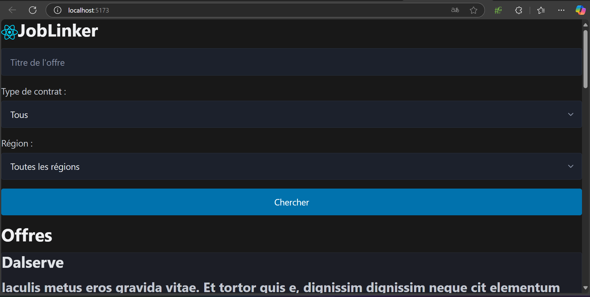
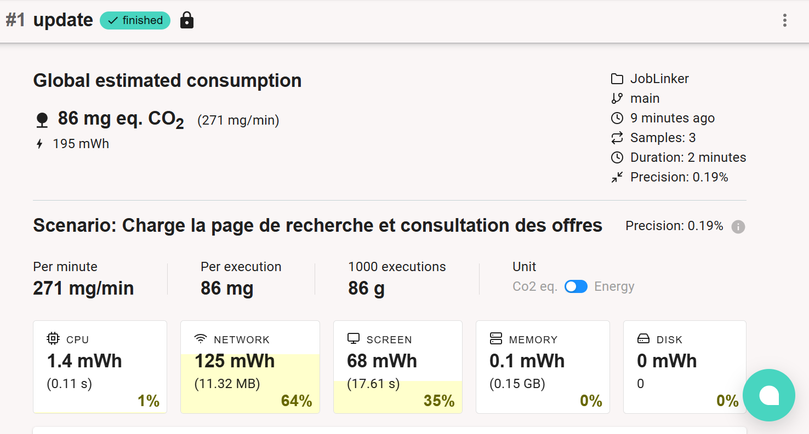
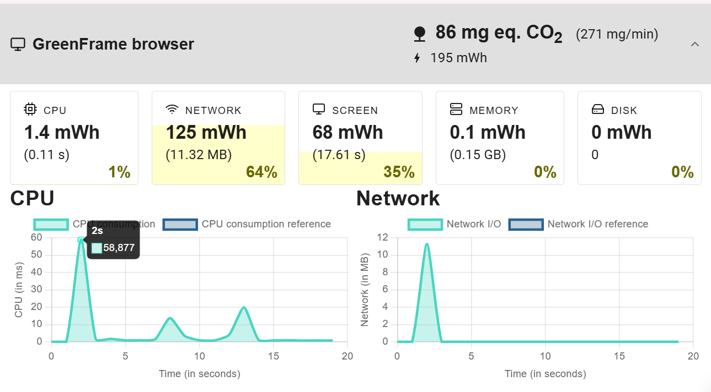
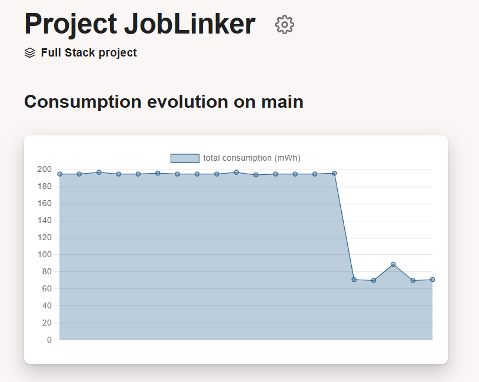
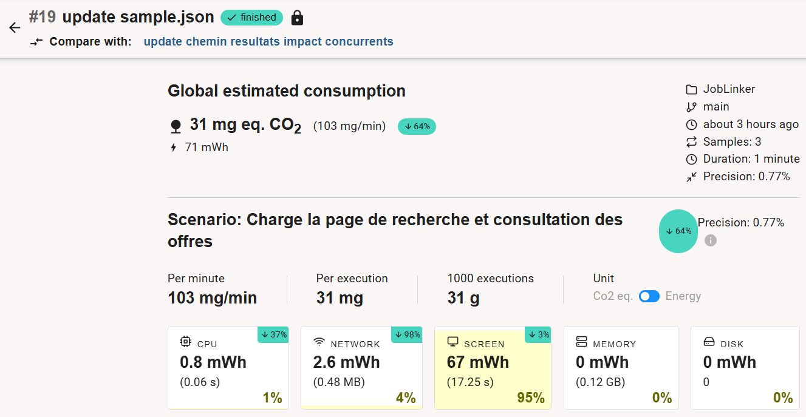
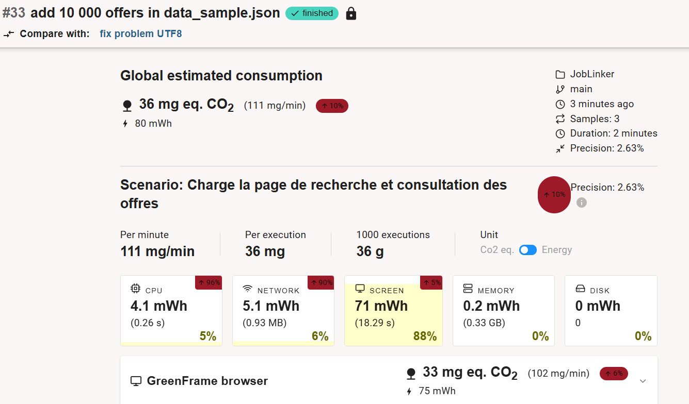
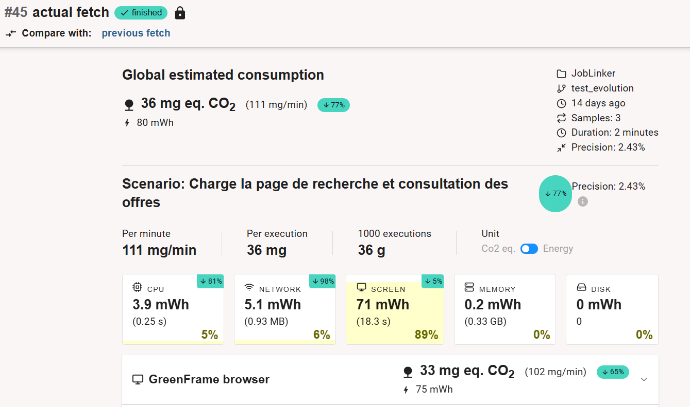

# JobLinker

## Description

Une application qui permet aux entreprises de publier des offres d'emploi et aux candidats de postuler facilement.

## Notre choix de sujet

Un réseau social professionnel en ligne est conçu pour aider les utilisateurs à établir des connexions professionnelles, à partager des informations sur leurs carrières et à découvrir des opportunités d'emploi. Les utilisateurs peuvent créer un profil en ligne qui détaille leur expérience professionnelle, leurs compétences, leur formation et leurs réalisations. Ce profil sert de CV numérique. Devant le succès des applications telles que LinkedIn, qui sert de plateforme essentielle pour le recrutement et le réseautage, nous en avons fait notre choix de sujet.

## Son utilité sociale

Dans un contexte professionnel en constante évolution, de nombreuses entreprises sont en recherche constante de nouveaux talents, et de nombreux individus cherchent à évoluer dans leur carrière et à élargir leur réseau. Les réseaux sociaux professionnels, tels que LinkedIn, ont gagné en popularité en servant de plateforme essentielle pour le recrutement et le réseautage. Avec plus de 950 millions d'utilisateurs dans le monde, LinkedIn joue un rôle clé en facilitant les connexions entre candidats et recruteurs. Avant la numérisation et l'arrivée d'Internet, les processus de recrutement se faisaient principalement via des annonces papier dans les journaux, les agences de recrutement ou lors de salons professionnels. Cependant, ces méthodes limitaient la portée de diffusion des offres, réduisant ainsi le nombre de candidats potentiels pour un poste. Avec l'usage de réseaux sociaux professionnels comme LinkedIn, ce problème a été résolu, car les offres peuvent être consultées par un public mondial en temps réel. Cela permet, d'une part, aux candidats d'accéder à une offre plus vaste, mieux adaptée à leur profil, et, d'autre part, aux entreprises de recruter dans un vivier de talents élargi, augmentant ainsi leurs chances de trouver le candidat idéal pour un poste donné.

## L'impact de sa numérisation

Malgré la forte utilité professionnelle des applications comme LinkedIn, il faut reconnaître qu’elles ont un impact écologique beaucoup plus important que la simple publication de petites annonces. En effet, ces applications proposent aujourd’hui une quantité très importante de fonctionnalités qui ne sont pas toujours indispensables. Si l’on prend l’exemple de LinkedIn, on retrouve au sein de cette application une messagerie instantanée, une partie « vidéos » qui ressemblent fortement à des "TikTok" en lien avec le milieu professionnel, une quantité très importante de notifications, etc.

Ces fonctionnalités sociales, en plus de ne pas toujours être nécessaires dans un contexte purement professionnel, consomment une quantité importante d’énergie. Chaque interaction supplémentaire – qu’il s’agisse d’envoyer un message, de visionner une vidéo, de recommander une personne ou de liker un post – génère des données qui doivent être traitées, stockées, et transmises, augmentant ainsi l’empreinte carbone des serveurs et des centres de données. De plus, ces éléments favorisent une utilisation prolongée de la plateforme, encourageant les utilisateurs à passer plus de temps dessus, souvent pour des activités qui ne sont pas directement liées à la recherche d’emploi ou au recrutement.

C’est pourquoi nous proposons de concevoir une version plus écologique de LinkedIn, qui ne serait plus un réseau social à proprement parler. En supprimant les fonctionnalités axennes, et/ou liées aux interactions sociales (faire suivre une annonce, recommander une personne, attester d'une compétence, etc.), nous permettrons de réduire l’impact environnemental de la plateforme, sans lui faire perdre son utilité. Cela permettra aux utilisateurs de se concentrer sur les fonctionnalités les plus profitables, telles que la publication d'offres d'emploi, la mise en avant des compétences des candidats, et la possibilité d'accéder directement aux coordonnées d'un recruteur et/ou d'un candidat.

Ce recentrage sur l’essentiel simplifiera également l’interface, rendant l’utilisation plus fluide et réduisant les ressources nécessaires à son fonctionnement. L’expérience deviendra plus rapide et intuitive, tout en évitant les distractions liées aux réseaux sociaux qui ne contribuent que marginalement à l’objectif professionnel. Par ailleurs, cette approche permettra de diminuer la consommation énergétique des utilisateurs eux-mêmes, notamment en termes de batterie et de bande passante, en réduisant le temps passé sur des fonctionnalités annexes.

Enfin, ce choix s’inscrit dans une démarche globale de promotion des pratiques numériques responsables. En nous détachant des logiques classiques des réseaux sociaux, nous affirmons l’importance de repenser les plateformes numériques pour limiter leur impact écologique, tout en répondant mieux aux besoins fondamentaux des utilisateurs.

## Scénarios d'usage et impacts

Nous faisons l'hypothèse que les utilisateurs visitent ces plateformes une fois par jour, en début ou en fin de journée, afin de découvrir les nouvelles opportunités d'emploi et de consulter les détails de celles qui nous intéressent. Ces visites peuvent durer quelques dizaines de minutes.
Nous choisissons délibérément de ne pas nous mettre dans la peau d'un recruteur, car nous n'avons pas une connaissance approfondie des fonctionnalités spécifiques auxquelles les recruteurs ont accès sur ces plateformes. Ce manque de visibilité nous conduit à privilégier une approche basée sur l'expérience du candidat, qui correspond à notre propre usage et compréhension des fonctionnalités.
Pour cette raison, nous avons choisi de modéliser les scénarios suivants : l'un focalisé sur la recherche d'offres récentes, et l'autre sur l'exploration des offres qui nous intéressent.

## Scénario 1 : "Recherche d'offres récentes"

1. L'utilisateur se rend sur la plateforme de recherche d'emploi.
2. Après s'être authentifié, il se rend dans la rubrique "offre d'emplois".
3. Il sélectionne des mots clés, une zone géographique, et le type de contract qui l'intéresse.
4. Il consulte les offres personnalisés qui lui sont proposés en fonction de ces paramètres.

## Scénario 2 : "Exploration des offres intéressantes"

1. L'utilisateur effectue à nouveau les étapes 1, 2 et 3 du scénario 1.
2. Il consulte les offres personnalisées qui lui sont proposés en fonction de ces paramètres.
3. Après avoir obtenu un aperçu des offres qui lui sont proposés, l'utilisateur clique sur le titre d'une offre qui l'intéresse.
4. Il consulte les détails de l'offre.
5. Il revient à la liste des recommandations pour poursuivre l'exploration.

## Impact de l'exécution des scénarios auprès de différents services concurrents

L'EcoIndex d'une page (de A à G) est calculé (sources : EcoIndex, Octo, GreenIT) en fonction du positionnement de cette page parmi les pages mondiales concernant :

- le nombre de requêtes lancées,
- le poids des téléchargements,
- le nombre d'éléments du document.

Nous avons choisi de comparer l'impact des scénarios sur les plateformes suivantes :

- LinkedIn,
- Jobteaser.

Les résultats sont les suivants (attention, d'une journée à l'autre, on peut observer une certaine variabilité) :

- [Resultats LinkedIn](./Resultats_LinkedIn.md)
- [Resultats Jobteaser](./Resultats_Jobteaser.md)

## Maquette de l'interface et échantillon de données

Au vu des différents services comparés, des exigences environnementales exprimées plus haut et des scénarios retenus, nous avons défini pour notre prototype une maquette de l'interface et un échantillon de données relativemment petit pour commencer ( entre 100 et 500 offres). Nous avons volontairement choisi de ne pas intégrer un système d'authentification (login et password) car cela aurait complexifié notre prototype et que nous disposons d'un temps limité pour ce projet.

L'interface retenue est donc composée d'un seul type de "page Web" avec:

- un header qui permet de rechercher des offres,
- un content qui affichent les offres liées à cette recherche.
  
  **Fig.1**: Maquette de l'interface du prototype : **a.** header pour la recherche, **b.** content pour les offres (liées à une recherche).

Il est possible d'accéder aux détails d'une offre en cliquant sur "voir plus" dans la description de l'offre, sans changer de page. Nous avons fait ce choix de conception car nous avons obtenu de meilleurs résultats qu'en créant deux types de pages web distincts (une page web dédiée à la recherche, une page web dédiée à l'affichage des offres et de leurs détails).
Egalement, dans un objectif de sobriété environnementale, nous avons choisi d'afficher les offres cinq par cinq.

## Prototype n°1 : Fonctionnalités pour le scénario prioritaire avec données statiques

Pour cette première version du prototype :

- l'échantillon de données est encore chargé dans le code de manière statique,
- les fonctionnalités implémentées ne sont que celles nécessaires pour suivre le scénario prioritaire ("Recherche d'offres intéressantes").

Comme dit précedemment, ce scénario ne nécessite pas de pouvoir naviguer entre plusieurs types de page.

### **Page de recherches et de consultation des offres**

Nous avons développé notre page web sous une forme proche de ce que prévoyait la maquette.

**Fig.2:** Prototype de la page de recherches et de consultation des offres

## Impact environnemental - Prototype n°1

Dans l'état actuel du prototype, il est possible d'avoir une première idée de l'impact environnemental du frontend. Bien entendu, il manque encore le chargement dynamique des données, mais nous pouvons déjà évaluer l'impact de l'affichage des données et du framework (au sens large : React, PicoCSS, DayJS). Cette évaluation de l'impact (cf. capture ci-dessous) est encourageante, que ce soit en mode "développement" comme en mode "pré-production".

- [Resultats obtenus](./Impact_environnemental_prototype1.md)

## Prototype n°2 : Fonctionnalités pour le scénario prioritaire avec données statiques chargées de manière dynamique

Pour cette deuxième version du prototype, les données (toujours statiques) sont désormais chargées par le frontend à travers le réseau immédiatement après un premier affichage à vide. 

## Impact environnemental - Prototype n°2

Concernant l'évaluation de l'impact environemental du scénario, par rapport au prototype n°1, nous constatons de lègères différences (nombre de requêtes un peu plus important) mais nos résultats sont toujours satisfaisants.

D'ailleurs, à partir de cette version, l'EcoIndex ne devrait plus évoluer de manière significative. C'est pourquoi nous utiliserons désormais un autre logiciel, GreenFrame, qui évalue non pas l'impact "environné" de la consultation (incorporant une participation au cycle de vie du terminal) mais celui de la consultation proprement dite et de manière beaucoup plus fiable à partir des statistiques d'utilisation des ressources physiques (CPU, mémoire, réseau, disque). Cependant, nous utiliserons GreenFrame uniquement sur notre application, et pas sur celles de nos concurrents à cause de problèmes d'autentification (login, password requis).

- 
- 
- .png)
- .png)

Nous constatons un niveau de solicitation du réseau assez élevé, qui explique que nous ayons des résulats un peu moins bons que prévu. Nous supposons que cela est lié à la quantité d'offres générées par le fichier "sample_data.jon". Pour rappel, nous avions choisi de générer plusieurs milliers d'offres pour obtenir un échantillon de données réaliste. Une autre piste d'amélioration à explorer lors de notre troisième prototype sera l'utilisation d'une base de données, qui devrait également diminuer la quantité de réseau utilisée. 

## Prototype n°3 : Fonctionnalités pour le scénario prioritaire avec données stockées dans une base de données

Pour la troisième version du prototype, les données sont désormais stockées dans un système de base de données interrogeable à travers une API Web (CouchDB). Pour rappel, lors de la conception de notre prototype n°2, nous avions émis l'hypothèse qu'utiliser une source de donnée dynamique et une base de données pourrait nous permettre de diminuer la quantité de réseau utilisée, qui était relativement haute. 

Voici les résulats que nous avons obtenus cette fois-ci :

- 
**Fig.3:** Evolution de la consommation - prototype 3
- 
**Fig.4:** Details de l'évolution - prototype 3

Nos mesures nous permettent de constater de bien meilleurs résultats que lors de notre précédent prototype, avec notamment une baisse importante de la charge du réseau (de 65% à 4%) entre les deux prototypes. L'utilisation d'une base donnée et la supression d'une partie du fichier sample_data.json (supression des profils utilisateurs qui n'étaient pas utilisés) peuvent expliquer ce constat, confirmant l'hypothèse émise lors des mesures d'impact de notre prototype n°2. 

L'intérêt d'une source de données dynamique est également, à terme, de pouvoir ajouter ou modifier des offres plus facilement, et de déporter sur le serveur le filtrage des données pertinentes. Dans ce prototype, le filtrage des données continue à se faire côté client. La déportation sur le serveur du filtrage des données sera effectué durant les sessions dédiées à l'amélioration de notre prototype.

## Prototype n°4 : Fonctionnalités pour le scénario prioritaire avec filtrage des données

**Passage à l'échelle** 

Nous savons déjà que les données pourraient se multiplier en ajoutant des profils utilisateurs. En effet, on a vu l'impact qu'a eu la suppression de nos milliers de profils entre le prototype 2 et le prototype 3, étape durant laquelle nous avons décidé de supprimer le concept de compte utilisateur pour des problèmes liés à l'authentification. 
En supposant que notre application soit un succès, le nombre d'offres sera forcément amené à augmenter avec le temps. Jusqu'ici, on générait entre 100 et 500 offres. Afin de tendre vers un échantillon de données plus réaliste, nous allons maintenant générer 10 000 offres pour observer l'impact de ce passage à l'échelle, ce qui revient à multiplier par 100 la quantité d'offres précédente. 
Pour le moment, nous continuons de charger toutes nos offres d'un coup, nous allons donc les charger 100 par 100 pour contre-balancer la forte augmentation du nombre d'offres dû au passage à l'échelle.

**Prise en compte du passage à l'échelle**

**Fig.5:** Augmentation de la consommation globale suite au passage à l'échelle - prototype 4

Après avoir ajouter nos 10 000 offres, on observe, une multiplication par 2 de l'impact du processeur, et de l'impact du réseau.

**Fig.6:** Diminution de la consommation suite au chargement des offres 100 par 100 - prototype 4

**Fig.7:** Diminution de la consommation globale suite au chargement des offres 100 par 100 - prototype 4

Nous pouvons constater ici que le chargement des offres 100 par 100 a bien eu un effet bénéfique, avec une division par 3 de l'impact global de notre prototype (passage de plus de 300mWh à moins de 100mWh). 
 

