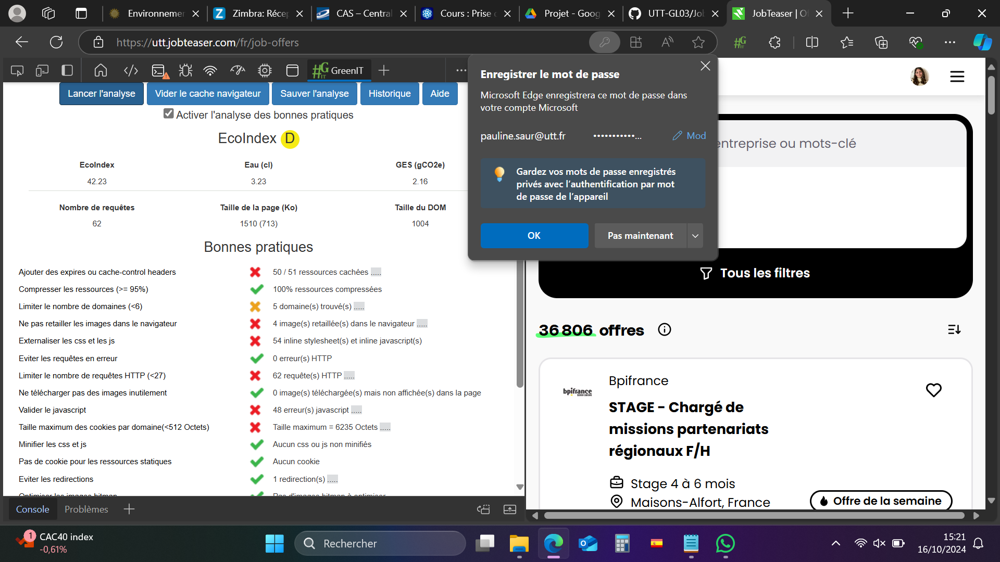
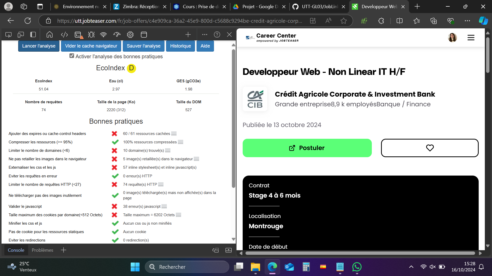
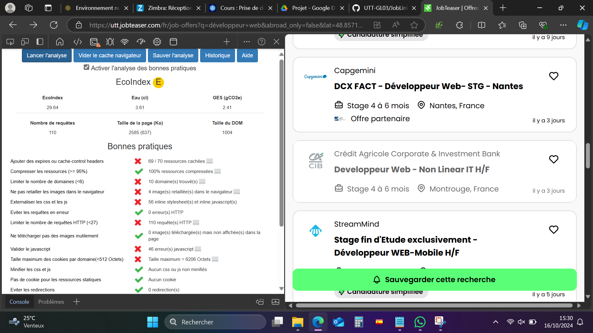

# Resultats obtenus - JobTeaser

- **Scénario 1 : "Recherche d'offres récentes"**

1. L'utilisateur se connecte à JobTeaser. 
2. Après s'être authentifié, il se rend dans la rubrique "offre d'emplois". 
3. Il sélectionne des mots clés, et la zone géographique qui l'intéresse. 
4. Il consulte les offres personnalisés qui lui sont proposés en fonction de ces paramètres. 

- **Scénario 2 : "Exploration des offres intéressantes"**

1. L'utilisateur effectue à nouveau les étapes 1, 2 et 3 du scénario 1. 
2. Il consulte les offres personnalisés qui lui sont proposés en fonction de ces paramètres. 
3. Après avoir obtenu un aperçu des offres qui lui sont proposés, l'utilisateur clique sur le titre d'une offre qui l'intéresse. 
4. Il consulte les détails de l'offre. 
5. Il revient à la liste des recommandations pour poursuivre l'exploration. 
